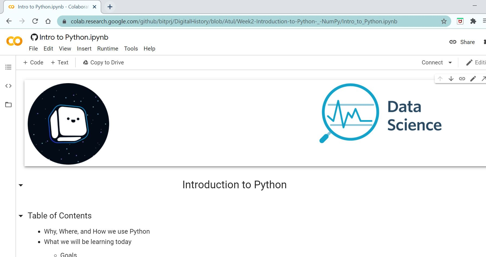
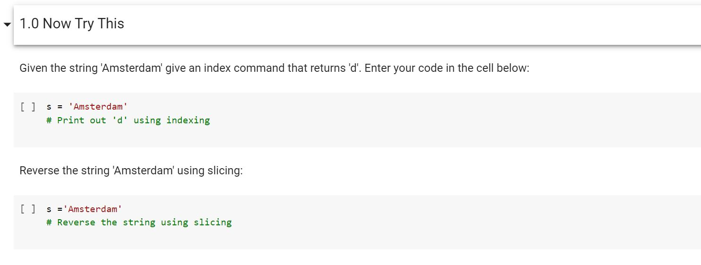

# Week 1: Introduction README

This is the introductory material for Bit Project’s Digital History course curriculum. This week’s material will cover the accessibility and navigational walkthrough for the tutorials and labs used in this course.

The instructional material for this course is hosted entirely online via Google Colab Jupyter Notebooks. Because of this, students will not need to install or download anything for their local system, which makes this course very easily accessible.

Each week, students will be given a link to access the assigned learning material, which consists of a Google Colab Tutorial as well as the course-curated dataset for the week. The tutorials contain all of the learning material as well as guided practice for students to apply their newly learned skills. 

The Digital History curriculum is currently hosted on Bit Project’s GitHub page. Each week features a different tutorial as labeled with the “.ipynb” file extension. In order to access the Google Colab Tutorials, students can click on the blue “Open in Colab” button at the top of the tutorial’s content section.

This will redirect to the Google Colab Jupyter Notebook environment that allows students to interact with the material and the provided exercises.
(The new page will have the url format: colab.research.google.com/github/bitprj/DigitalHistory/…)

Within this environment, students can read through the learning content, and interact with the material by running the code provided.
(To execute lines of code, students can either press the PLAY button on the left hand side of the code block, or press SHIFT + ENTER.)

The output for the executed code will appear underneath the code block.

The tutorials also feature “Now Try This” sections that allow students the opportunity to practice applying their newly learned skills. The solutions can also be provided for these exercises.

